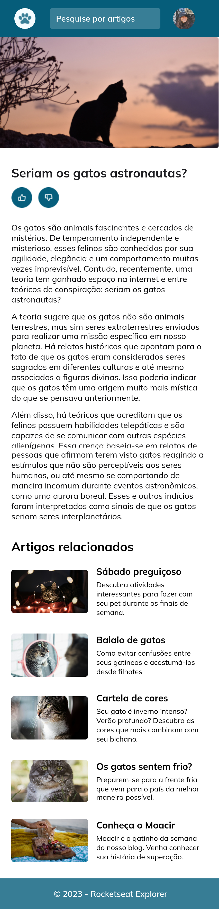

<h1 align="center"> Desafio - Layout para mobile</h1>

Projeto desenvolvido individualmente durante os estudos do Stage 3 na trilha Explorer da Rocketseat.

  

#### Esse projeto foi desenvolvido com as seguintes tecnologias:

- HTML e CSS
- Git e Github
- Figma

#### Você pode visualizar o layout do projeto através [DESSE LINK](<https://www.figma.com/file/TDGKYSgOpmR3kTj9OauE38/Blog-de-Gatos-%E2%80%A2-Desafio-Explorer-(Community)?type=design&node-id=101-91&mode=design&t=JmwD212mVI7oKmRJ-0>).
